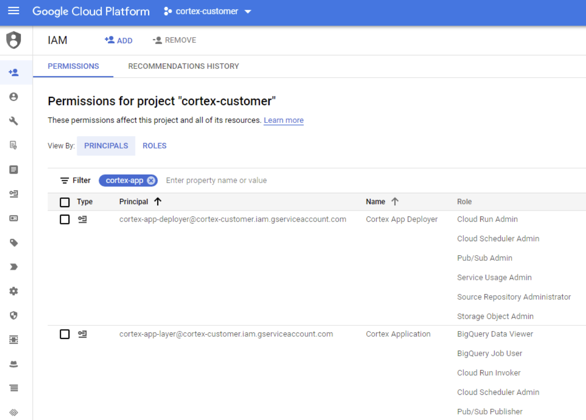
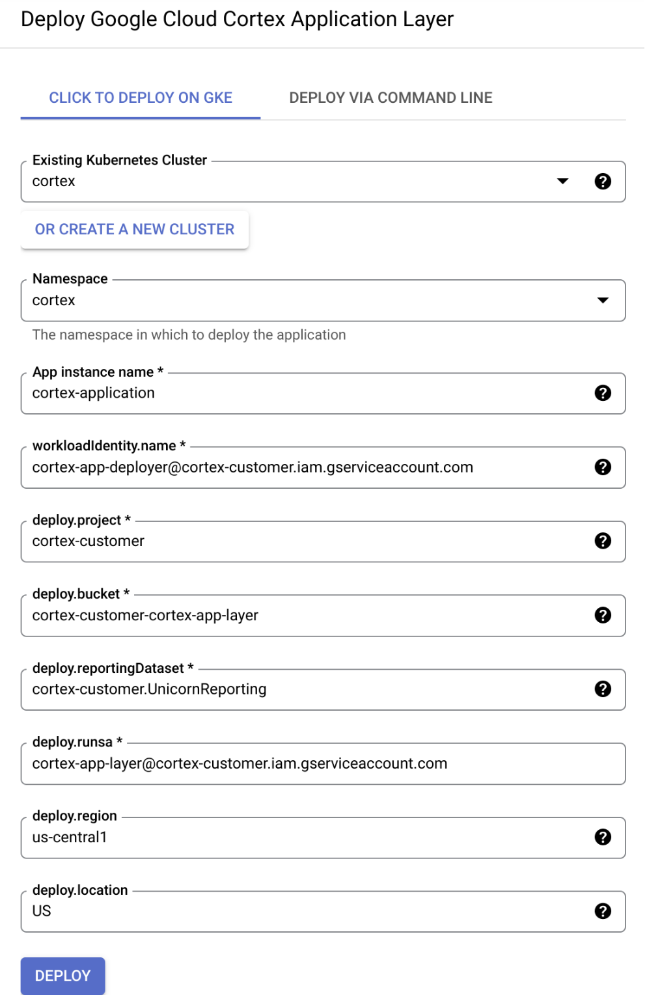
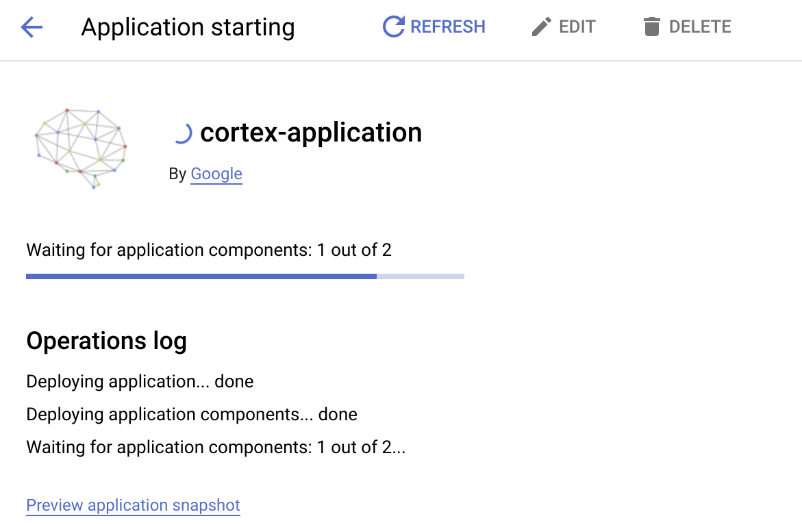
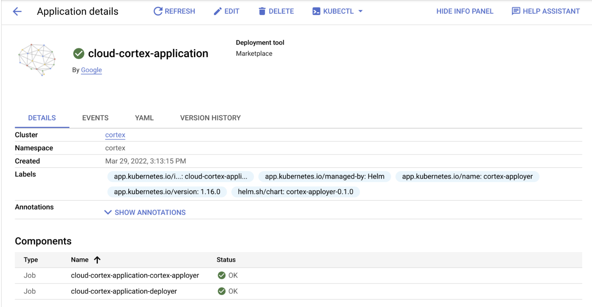
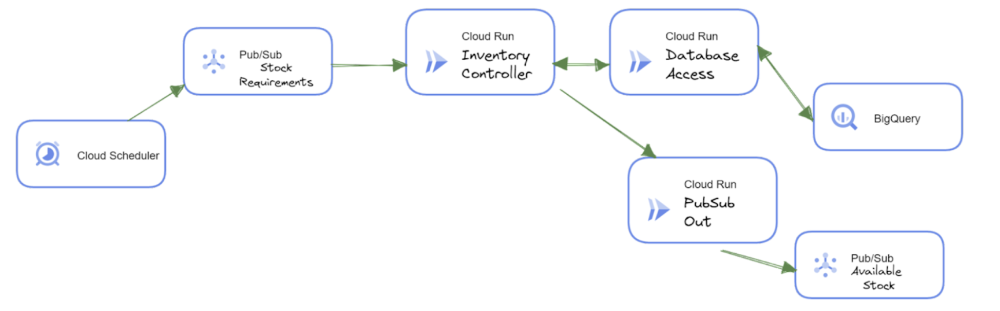

# Google Cloud Cortex Framework Application Layer Deployment Guide

Last update: Mar 29, 2022
Contact: cortex-support@google.com

____  


## About this document

This guide describes how to prepare your environment to deploy Google Cloud Cortex Framework Application Layer, it should be used in conjunction with [Google Cloud Cortex Framework Data Foundation](https://github.com/GoogleCloudPlatform/cortex-data-foundation). 

**This guide is useful for and should be completed by:** Google Cloud Data and Analytics Technical Practitioners (or similar profiles) and Software Developers/Architects (or similar profiles). Readers will benefit from having previous understanding of general cloud-native development principles and containers.

**By the end of this guide, you will:**
1. Have a functional Application Framework 
1. Understand the recommended design patterns and how to effectively consume Cortex Data Foundation information from your application
1. Be able to tweak the application and experiment in your own environment


## About the Application Framework

Google Cloud Cortex Framework Application Layer helps facilitate integration with external applications to consume results from Cortex Data Foundation. Through a microservices-based approach integration is enabled through secure, scalable, and production ready APIs and [Pub/Sub](https://cloud.google.com/pubsub) messages. The goal of this layer is to provide sample patterns for interoperability between Cortex Data Foundation and other platforms that customers can customize to serve their own technical and business needs.

## Deployment

This section details all you need to get  Cortex Application Layer deployed.

### Prerequisites
Before starting ensure that you:

1. Have deployed [Cortex Framework Data Foundation](https://github.com/GoogleCloudPlatform/cortex-data-foundation).
1. Have a project with billing enabled where you can:
    1. Create buckets
    1. Create service accounts
    1. Grant permissions to the service accounts
    1. Create a GKE cluster
    1. Configure Identity Management 

Refer to our [IAM permissions reference](https://cloud.google.com/iam/docs/permissions-reference) to ensure you have all you need before getting started.

We recommend being familiar with the following technologies:
- [Docker](https://www.docker.com/)
- [Cloud Run](https://cloud.google.com/run) or [Kubernetes](https://kubernetes.io/)
- [Pub/Sub](https://cloud.google.com/pubsub) or general message queues concepts
- [Google Cloud Platform](https://cloud.google.com/) basic concepts


### Step-by-step instructions
You should follow these instructions on the project you want to deploy the Cortex Application Layer.

#### **1. Setup your shell environment**

If you plan to use the command line for this, launch the [Cloud Shell](https://cloud.google.com/shell) by clicking in the following icon:  located in the top right corner of the console. Alternatively navigate to: https://ide.cloud.google.com/

Then configure gcloud:
```shell
# export required variables
export PROJECT_ID="your_project_id" # modify to be your project value
export REGION="us-central1" #modify to any valid GCP region
export NAMESPACE="cortex" #modify to use the namespace you want
# configure gcloud
gcloud config set project $PROJECT_ID
gcloud config set compute/region $REGION
# export additional variables needed
export PROJECT_NUMBER=$( gcloud projects describe $PROJECT_ID --format 'value(projectNumber)' )
```

#### **2. [Create a bucket](https://cloud.google.com/storage/docs/creating-buckets):**
```shell
gsutil mb gs://$PROJECT_ID-cortex-app-layer
```

#### **3. [Create a Service Account](https://cloud.google.com/iam/docs/creating-managing-service-accounts#creating) for the deployment**
```shell
gcloud iam service-accounts create cortex-app-deployer \
    --description="Deploy Cortex Application Layer" \
    --display-name="Cortex App Deployer"
```

#### **4. [Grant the Service Account the following IAM](https://cloud.google.com/iam/docs/granting-changing-revoking-access#single-role) permissions:**
1. Cloud Run Admin
1. Cloud Scheduler Admin
1. Pub/Sub Admin
1. Service Usage Admin
1. Source Repository Administrator
1. Storage Object Admin
1. Service Account User
```shell
for role in 'roles/run.admin' 'roles/cloudscheduler.admin' 'roles/pubsub.admin' 'roles/serviceusage.serviceUsageAdmin' 'roles/source.admin' 'roles/storage.objectAdmin' 'roles/iam.serviceAccountUser' ; do
    gcloud projects add-iam-policy-binding $PROJECT_ID \
        --member="serviceAccount:cortex-app-deployer@$PROJECT_ID.iam.gserviceaccount.com" \
        --role="$role"
done
```
#### **5. [Create a Service Account](https://cloud.google.com/iam/docs/creating-managing-service-accounts#creating) for the Cloud Run services**
```shell
gcloud iam service-accounts create cortex-app-layer \
    --description="Run Cortex Application Layer Services" \
    --display-name="Cortex Application"
```

#### **6. [Grant the Service Account the following IAM](https://cloud.google.com/iam/docs/granting-changing-revoking-access#single-role) permissions:**
1. Cloud Run Invoker
1. BigQuery Data Viewer
1. BigQuery Job User
1. Pub/Sub Publisher
```shell
for role in 'roles/run.invoker' 'roles/cloudscheduler.admin' 'roles/bigquery.dataViewer' 'roles/bigquery.jobUser' 'roles/pubsub.publisher' ; do
    gcloud projects add-iam-policy-binding $PROJECT_ID \
        --member="serviceAccount:cortex-app-layer@$PROJECT_ID.iam.gserviceaccount.com" \
        --role="$role"
done
```


**Important:** 
> If your Reporting dataset for Cortex Data Foundation is in a different project ensure you grant the BigQuery Data Viewer and BigQuery Job User permissions for this service account in that project. 

In case your reporting dataset is in the same project as the application layer this is what you will have at the end of steps 3-6:



#### **7. Configure Pub/Sub to allow Cloud Run authentication ([learn more about integrating with pub/sub](https://cloud.google.com/run/docs/tutorials/pubsub#integrating-pubsub))**

```shell
gcloud services enable pubsub.googleapis.com
gcloud projects add-iam-policy-binding $PROJECT_ID \
     --member=serviceAccount:service-$PROJECT_NUMBER@gcp-sa-pubsub.iam.gserviceaccount.com \
     --role=roles/iam.serviceAccountTokenCreator
```

#### **8. [Create a GKE Cluster](https://cloud.google.com/kubernetes-engine/docs/how-to/creating-a-zonal-cluster)**

In this step you can also opt to let the marketplace create the cluster for you. Creating it yourself has advantages since you can control several parameters including whether the cluster is public or not. See [documentation](https://cloud.google.com/kubernetes-engine/docs/how-to/creating-a-zonal-cluster) to customize your cluster. For deploying this application we require that the workload identity pool is enabled as described below. 
```shell
# this creates a very bare-minimum cluster with all defaults
gcloud container clusters create cortex \
    --workload-pool=$PROJECT_ID.svc.id.goog
```

If you already have a cluster [update it to enable Workload Identity](https://cloud.google.com/kubernetes-engine/docs/how-to/workload-identity#enable-existing-cluster) pool.

#### **9. [Configure Workload Identity](https://cloud.google.com/kubernetes-engine/docs/how-to/workload-identity)**

You should do this step even if you skip cluster creation - however you will need to get the marketplace to create the cluster for you first and then manually enable the workload-pool  ([learn more about workload identity](https://cloud.google.com/kubernetes-engine/docs/how-to/workload-identity)).
```shell
gcloud iam service-accounts add-iam-policy-binding cortex-app-deployer@$PROJECT_ID.iam.gserviceaccount.com \
  --role roles/iam.workloadIdentityUser \
  --member "serviceAccount:$PROJECT_ID.svc.id.goog[$NAMESPACE/cortex-apployer-bot]"
```

#### **10. Collect the information you’ll need**

If you did not customize the names above you can use the below snippet to conveniently print the parameters for you in the console. This allows you to simply copy and paste into the Marketplace UI:

```shell
cat << EOF

============ Your deployment parameters ============
namespace = $NAMESPACE
workloadIdentity.name = cortex-app-deployer@$PROJECT_ID.iam.gserviceaccount.com
deploy.project = $PROJECT_ID
deploy.bucket = $PROJECT_ID-cortex-app-layer
deploy.reportingDataset = Input Cortex Data Foundation Reporting Dataset in the format PROJECT.DATASET
deploy.runsa = cortex-app-layer@$PROJECT_ID.iam.gserviceaccount.com
deploy.region = $REGION
deploy.location = Use BigQuery location for Cortex Reporting Dataset
============================================================

EOF
```


#### **11. Marketplace deployment**

On the marketplace navigate to Cortex Application Layer deployment page.
Now we will use the information we populated above; this table illustrates what each variable represents.


|Name | Description | Mandatory | Default Value  |
|-----|------------|-----------|----------------|
| workloadIdentity.name | This is the `cortex-app-deployer` you created on step #3 | Y | N/A |
| deploy.project | ID of the project the Cortex Sample Application will be deployed into | Y | N/A |
| deploy.bucket | Name of the bucket which will contain the resources state | Y | N/A |
| deploy.reportingDataset | Cortex Data Foundation Reporting Dataset in the format PROJECT.DATASET | Y | N/A |
| deploy.runsa | This is the `cortex-app-layer` service account created on step #5 | Y | N/A |
| deploy.region | Compute region for the services | N | us-central1 |
| deploy.location | BigQuery Location for the dataset | N | US |


This is what the deployment configuration page looks like:



When deploying the application you should be automatically redirected to to the kubernetes applications page:



Once deployed you should see the application listed in your kubernetes cluster under `Applications`:




## Deployed artifacts

This application is composed of the following resources:

1. [Cloud Scheduler](https://cloud.google.com/scheduler)
    - Publishes sample inventory request messages into Pub/Sub input topic
1. [Pub/Sub](https://cloud.google.com/pubsub)
    - Input topic and subscription
    - Output topic (you can pull later)
1. [Cloud Run](https://cloud.google.com/run)
    - Inventory Controller
    - Data Access Layer (DAL)
    - Inventory Output Service


Example:


Here is what happens in the flow above:
- The Cloud Scheduler triggers a sample message into the Pub/Sub input topic.
- This topic has a push subscription that triggers Inventory Controller in Cloud Run.
- Inventory Controller then accesses Cortex Data Foundation (Reporting) in order to obtain the desired information via the DAL service.
- The DAL replies to the Inventory Controller with the query results
- The Inventory Services then publishes that information to an arbitrary output, in this case a Pub/Sub topic that could be consumed by other systems.
    - The output service is dedicated to output only, image abstraction of logic when you have multiple controllers which is a more likely scenario in production applications.

In a real world application it's likely that Cloud Scheduler sending sample messages would be replaced by a real system that is meant to consume the service; for example a BTP system.

Conversely the output could be anything that is meant to consume the result of the queries. Pub/Sub is used since it has a wide range of applications and is easy to integrate with other systems but it could also have been a HTTPS endpoint or an [gRPC](https://grpc.io/docs/what-is-grpc/core-concepts/) message with Protobuf, etc. In essence anything you could do in a Cloud Native application.


In addition to the application resources the following are deployed
- [Cloud Source Repository](https://cloud.google.com/source-repositories)
    - Contains the sample code so you can inspect it
- [Terraform](https://www.terraform.io/) state (in the provided bucket)
    - Contains the terraform state for you to import and modify as you want


## Removing the application
To remove the application without removing the project do the following:

1. [Clone](https://git-scm.com/book/en/v2/Git-Basics-Getting-a-Git-Repository) the sample code in the source repository provided and navigate to the terraform folder
```shell
git clone <<repository name>>
cd <<repository folder>>
```

2. type `terraform init`
3. Type `terraform destroy` (this will remove all resources created by the application.)
4. Uninstall the marketplace deployment from the cluster (or delete the cluster if you no longer need it)
5. Remove services accounts created during the steps above. 
6. Remove bucked created on deploy section.

Alternatively you can simply delete the project.

**Note:** 
> Ensure you have terraform version 1.1.7 or higher installed.


## Considerations

This application is a sample that shows how to consume Cortex Data Foundation from a microservices-based application. It's meant to demonstrate best practices of cloud native distributed applications you can adopt in your own environment and further integrate with your workflows and applications to bring the data where it’s needed the most.
Note that while we cover a good range of practices within this sample application there are further best practices you should consider adopting when deploying an application in production.

1. Protect your endpoints. For example:
    - If you have a public endpoint you should add [Cloud Armor](https://cloud.google.com/armor) which will give you protection against the top 10 OWASP and a few more goodies; 
    - On the other hand if you want to expose the application within a context to a specific group of people you can implement [Identity Aware Proxy](https://cloud.google.com/iap). 
    - Authentication between services should use service accounts and IAM enforcing the points below as well.
    - In case you need to protect sensitive data you may also want to look at [VPC SC](https://cloud.google.com/vpc-service-controls).
2. Ensure separation of concerns. For example:
    - Create one service account per service you are running.
    - You can provision firewall rules based on service accounts.
    - Do not reuse secrets and tokens across the environment.
    - Likewise, do not re-use service accounts across environments
3. Principle of least privilege. For example: 
    - You can grant only the necessary permissions for an application; Say you have a service that needs to publish messages to a topic, all it needs to accomplish this is [Pub/Sub](https://cloud.google.com/pubsub/docs/access-control#roles) to the topic. 
    - You can provide the service account access to the specific resource it needs instead of a project wide access, many resources allow this. For example instead of granting Storage Object Admin to the project you can do it at a bucket level.


These are just a few suggestions that every production ready application should consider. However, there are more amazing resources available for you to increase security and reliability. 

Here are a few examples:
- [Google Cloud security best practices center](https://cloud.google.com/security/best-practices)
- [Best practices for enterprise organizations](https://cloud.google.com/docs/enterprise/best-practices-for-enterprise-organizations)
- [Building Secure & Reliable Systems](https://sre.google/books/)


## Troubleshooting

If you missed a step in the configuration the installation will fail. 

At this point there are two options, the obvious one is to retry the installation from the marketplace once you correct the missing configuration.

However, if the installation created the Cloud Source Repository you can actually interact with the terraform code directly. This is also the recommended approach if you want to tweak the code or simply play around with the application.

Simply clone the repository, navigate to the terraform folder and do a  `terraform init` followed by a `terraform apply` after.

```shell
gcloud source repos clone cortex-sample-app --project="$PROJECT_ID"
cd cortex-sample-app/src/terraform
terraform init

# optionally if you made changes
terraform apply
```

You can also inspect the service URLs in the output
```shell
terraform output
```


